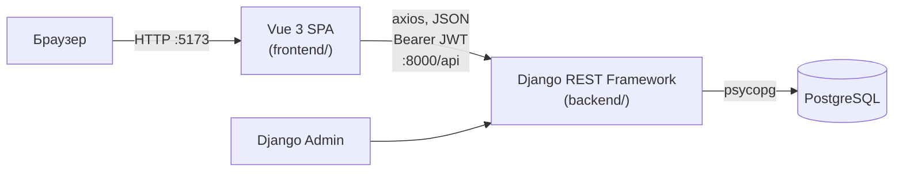
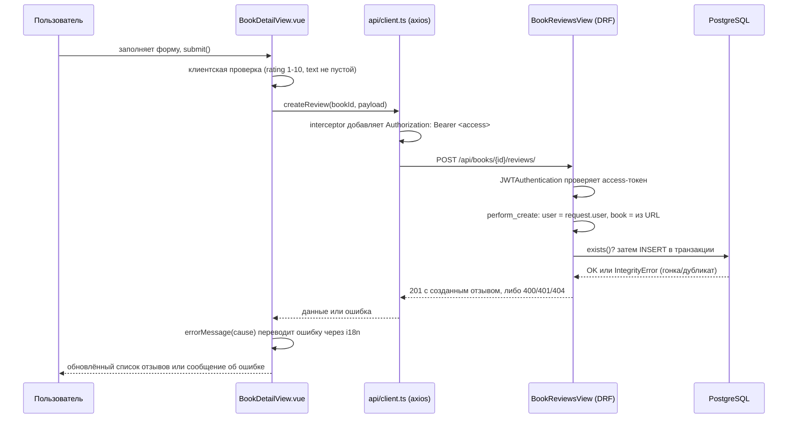
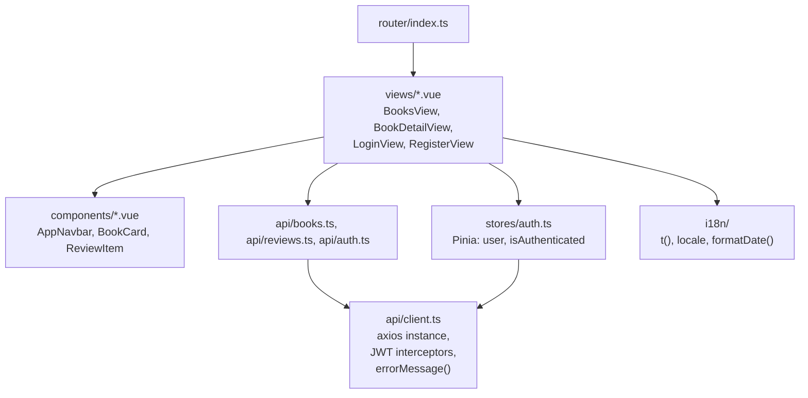
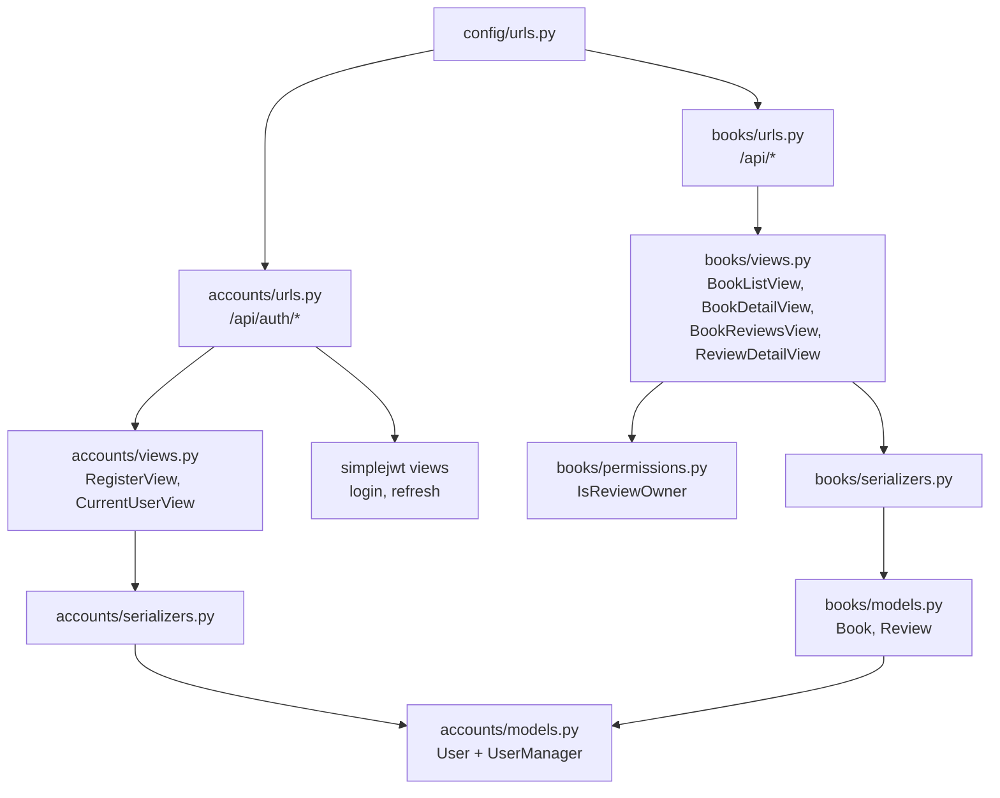

# Архитектура

Как устроены части ShelfTalk и как между ними идут данные. Установка — в
[SETUP.md](SETUP.md), эндпоинты — в [API.md](API.md), модели — в
[DATA_MODEL.md](DATA_MODEL.md).

## Обзор компонентов

Классическая связка SPA + REST API + реляционная БД: два независимых процесса (Vite
dev-сервер и Django), которые общаются только по HTTP.

- **frontend/** — Vue 3 + TypeScript SPA, собирается Vite, при разработке крутится
  отдельным dev-сервером на порту 5173. Ничего не рендерит на сервере — вся логика в
  браузере.
- **backend/** — Django + Django REST Framework, отдаёт JSON API и Django Admin.
  Единственная точка записи данных о книгах — Admin (см. ниже).
- **PostgreSQL** — единственное хранилище. Ни кеша, ни очередей, ни фоновых задач в
  проекте нет.

## Поток запроса: «оставить отзыв»

Показывает, как проходят типичный аутентифицированный запрос и токены между слоями.

Ключевые решения, которые видно из кода:

- **Автор и книга берутся не из тела запроса**, а из `request.user` и параметра URL
  (`books/views.py: BookReviewsView.perform_create`) — поэтому подделать поля
  `user`/`book` в JSON нельзя (закреплено тестом
  `test_create_review_ignores_forged_author_and_book`).
- **Двойная проверка дубликата отзыва**: сперва `exists()` для быстрого и понятного 400,
  затем перехват `IntegrityError` от `UniqueConstraint` на случай гонки двух
  параллельных запросов от одного пользователя.
- **Access-токен обновляется прозрачно**: response-interceptor в
  `frontend/src/api/client.ts` ловит первый 401, один раз пробует `/auth/refresh/` и
  повторяет исходный запрос; если refresh тоже не прошёл — разлогинивает через событие
  `auth-expired`.

## Frontend изнутри

| Модуль           | Назначение                                                                                                                                                                     |
| ---------------- | ------------------------------------------------------------------------------------------------------------------------------------------------------------------------------ |
| `views/`         | Страницы, подключённые к роутеру. Сами делают запросы и хранят локальное состояние формы.                                                                                      |
| `components/`    | Переиспользуемые части UI без собственных API-запросов (`BookCard`, `ReviewItem`, `AppNavbar`).                                                                                |
| `api/`           | Тонкие обёртки над эндпоинтами (`auth.ts`, `books.ts`, `reviews.ts`) плюс общий `client.ts`.                                                                                   |
| `stores/auth.ts` | Pinia-стор: текущий пользователь и его наличие; токены хранит `api/client.ts`.                                                                                                 |
| `i18n/`          | Собственный (без библиотек) модуль интернационализации — язык, переводы, плюрализация, формат дат. Подробности и как добавить язык — в docstring `frontend/src/i18n/index.ts`. |
| `router/`        | Маршруты `vue-router`; доступ к «своим» действиям проверяют сами страницы, а не роутер.                                                                                        |
| `types/`         | TypeScript-интерфейсы, зеркалящие сериализаторы DRF.                                                                                                                           |

Компонент не хранит токены сам — они лежат в `localStorage` и управляются только через
`api/client.ts` (`clearTokens`) и `stores/auth.ts`. Так `App.vue` при старте один раз
запрашивает `/auth/me/`, если токен есть, и только после этого показывает страницы.

## Backend изнутри

| Django-приложение | Назначение                                                                                                                                        |
| ----------------- | ------------------------------------------------------------------------------------------------------------------------------------------------- |
| `config/`         | Настройки, корневые маршруты, WSGI-точка входа. Ничего специфичного для домена.                                                                   |
| `accounts/`       | Кастомный пользователь (email вместо username), регистрация, логин/refresh через `djangorestframework-simplejwt`, эндпоинт текущего пользователя. |
| `books/`          | Каталог книг (только чтение через API) и отзывы (CRUD с проверкой владения).                                                                      |

Почему решено именно так — там, где это видно из кода:

- **Email как логин, без username** (`accounts/models.py`) — регистрация в проекте
  задумана по email, отдельное имя пользователя было бы лишним полем.
- **Уникальность email проверяется дважды**: в сериализаторе (для аккуратного 400) и
  `UniqueConstraint` по `Lower(email)` в БД (финальная защита от гонки и от прямых
  вставок в обход API, например через Admin).
- **Каталог книг доступен только на чтение через API** (`BookListView`, `BookDetailView`
  не поддерживают запись) — книги добавляются вручную через Django Admin или
  `python manage.py seed_books`, у проекта нет сценария самостоятельного добавления книг
  пользователями.
- **JWT, а не сессии** (`REST_FRAMEWORK.DEFAULT_AUTHENTICATION_CLASSES`) — подходит SPA,
  которое обращается к API с отдельного порта/домена в dev-режиме.

## Внешние зависимости

| Зависимость                     | Роль                                                                            |
| ------------------------------- | ------------------------------------------------------------------------------- |
| `djangorestframework`           | REST-слой поверх Django ORM.                                                    |
| `djangorestframework-simplejwt` | Выдача и обновление JWT (`accounts/urls.py`, `config/settings.py: SIMPLE_JWT`). |
| `django-cors-headers`           | Разрешает запросы с origin фронтенда (`CORS_ALLOWED_ORIGINS` в `.env`).         |
| `psycopg[binary]`               | Драйвер PostgreSQL.                                                             |
| `python-dotenv`                 | Подгружает переменные из корневого `.env` в `config/settings.py`.               |
| `axios`                         | HTTP-клиент фронтенда с перехватчиками токена и обновления сессии.              |
| `pinia`                         | Хранилище состояния (только `stores/auth.ts`).                                  |
| `vue-router`                    | Клиентская маршрутизация.                                                       |

Полный список версий: [backend/requirements.txt](../backend/requirements.txt),
[frontend/package.json](../frontend/package.json).

## За рамками архитектуры

Нет очередей, кеша, фоновых задач, файлового хранилища и внешних интеграций (почта,
платежи, сторонние API) — всё взаимодействие ограничено связкой браузер → Django →
PostgreSQL. Список известных ограничений — в [docs/TODO.md](TODO.md).
