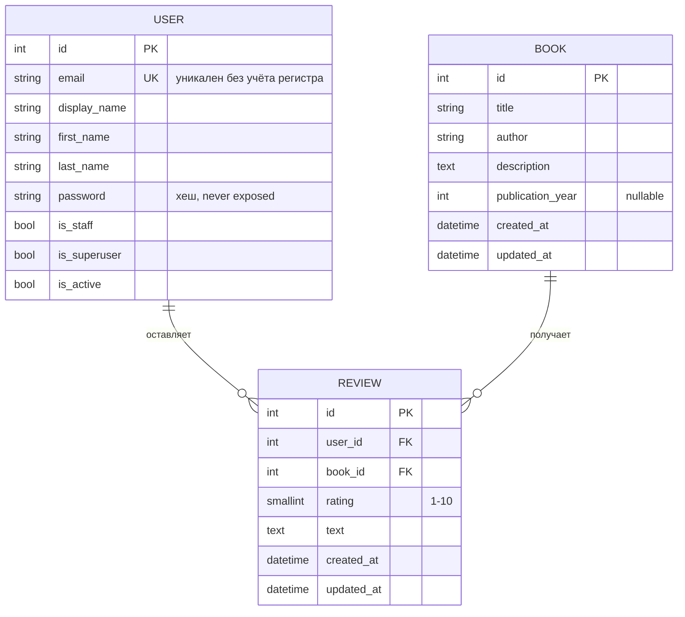

# Модель данных

Три сущности, все — обычные модели Django ORM. Определения:
[backend/accounts/models.py](../backend/accounts/models.py),
[backend/books/models.py](../backend/books/models.py). Архитектура сервисов —
[ARCHITECTURE.md](ARCHITECTURE.md), эндпоинты — [API.md](API.md).

## ER-диаграмма

## User (`accounts.models.User`)

Наследует `AbstractUser`, но убирает `username` — логин только по email.

| Поле                      | Тип                        | Ограничения                                                                      |
| ------------------------- | -------------------------- | -------------------------------------------------------------------------------- |
| `email`                   | `EmailField`               | `unique=True` + `UniqueConstraint(Lower("email"))` — уникален без учёта регистра |
| `display_name`            | `CharField(max_length=80)` | видно другим читателям как автор отзыва                                          |
| `first_name`, `last_name` | из `AbstractUser`          | необязательны, есть в API, но нигде в UI не показываются                         |
| `password`                | из `AbstractUser`          | хранится хешем, `RegisterSerializer` прогоняет через `AUTH_PASSWORD_VALIDATORS`  |

`USERNAME_FIELD = "email"`, `REQUIRED_FIELDS = []`. Создание пользователей идёт только
через `UserManager` (`create_user`/`create_superuser`), который нормализует email в
нижний регистр — это гарантирует, что регистр буквы в письме не создаст «второго»
пользователя.

## Book (`books.models.Book`)

| Поле                       | Тип                                   | Заметки                     |
| -------------------------- | ------------------------------------- | --------------------------- |
| `title`, `author`          | `CharField(max_length=200)`           |                             |
| `description`              | `TextField(blank=True)`               | может быть пустой строкой   |
| `publication_year`         | `IntegerField(null=True, blank=True)` | `null`, если год неизвестен |
| `created_at`, `updated_at` | `DateTimeField`                       | `auto_now_add`/`auto_now`   |

Сортировка по умолчанию: `("title", "id")`. Изменяется только через Django Admin или
`seed_books` — API отдаёт книги на чтение (см.
[ARCHITECTURE.md](ARCHITECTURE.md#backend-изнутри)).

`average_rating` и `reviews_count`, которые видны в API, — **не поля модели**, а
аннотации (`Avg`/`Count` по связанным `Review`), добавленные в
`books.views.BookListView.queryset`.

## Review (`books.models.Review`)

| Поле                       | Тип                                                           | Ограничения                                                              |
| -------------------------- | ------------------------------------------------------------- | ------------------------------------------------------------------------ |
| `user`                     | `ForeignKey(User, on_delete=CASCADE)`                         | автор; отзыв удаляется вместе с пользователем                            |
| `book`                     | `ForeignKey(Book, on_delete=CASCADE, related_name="reviews")` | книга; отзыв удаляется вместе с книгой                                   |
| `rating`                   | `PositiveSmallIntegerField`                                   | `MinValueValidator(1)`, `MaxValueValidator(10)` + `CheckConstraint` в БД |
| `text`                     | `TextField`                                                   | обязателен, пустая строка отклоняется на уровне API-валидации (не БД)    |
| `created_at`, `updated_at` | `DateTimeField`                                               | `auto_now_add`/`auto_now`                                                |

Constraints на уровне БД (последняя линия защиты при гонках, основная проверка — в API):

- `one_review_per_user_book` — `UniqueConstraint(fields=["user", "book"])`: один отзыв
  от пользователя на книгу.
- `rating_between_1_and_10` — `CheckConstraint`: рейтинг от 1 до 10 даже в обход
  API/валидатора.

Сортировка по умолчанию: `("-created_at", "-id")` — новые отзывы первыми.

## Миграции

Каждое приложение имеет одну миграцию: `accounts/migrations/0001_initial.py`,
`books/migrations/0001_initial.py`. Как применить и заполнить демо-данными — в
[SETUP.md](SETUP.md#миграции-и-демо-данные).
